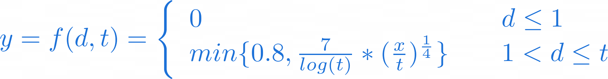
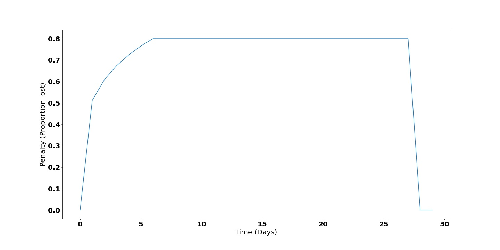
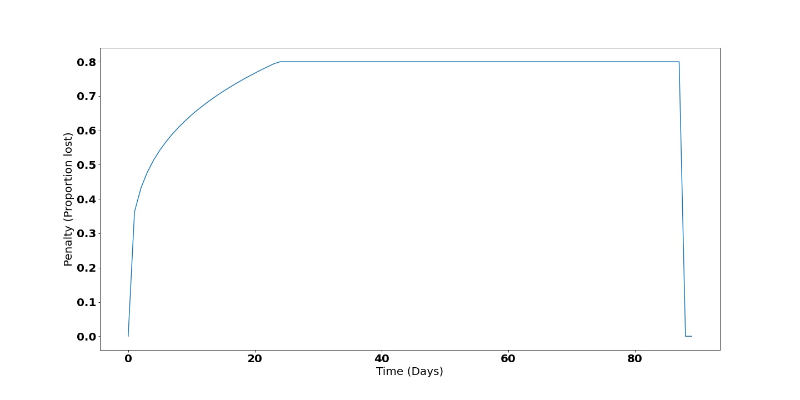
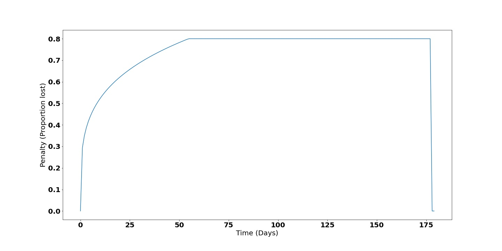
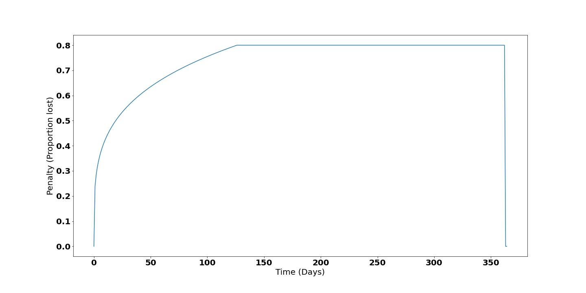

# Penalty 

The plots and data are generated by [this script](penalty.py)

## Plots showing penalty over time (days)

### Penalty function


In latex:
```latex
y = f(d,t) = \left\{
        \begin{array}{ll}
            0 & \quad d \leq 1 \\
            min\{0.8, \frac{7}{log(t)} * (\frac{x}{t})^{\frac{1}{4}}\} & \quad 1 < d \leq t
        \end{array}
    \right.
```

As image:



Where:

- $d$ is the current day in the staking period starting at $d = 0$ and ending at day $d=t$
- $t$ is the duration of the period, where $t \in \{30, 90, 180, 365\}$.


### 30 day



### 90 day



### 180 day



### 365 day



## Penalty tables, data used for the plots

### 30 day

|   day |   penalty |
|------:|----------:|
|     0 |      0    |
|     1 |      0.51 |
|     2 |      0.61 |
|     3 |      0.67 |
|     4 |      0.72 |
|     5 |      0.77 |
|6 to 27|      0.8  |
|    28 |      0    |
|    29 |      0    |

### 90 day

|   day |   penalty |
|------:|----------:|
|     0 |      0    |
|     1 |      0.36 |
|     2 |      0.43 |
|     3 |      0.48 |
|     4 |      0.51 |
|     5 |      0.54 |
|     6 |      0.57 |
|     7 |      0.59 |
|     8 |      0.61 |
|     9 |      0.63 |
|    10 |      0.64 |
|    11 |      0.66 |
|    12 |      0.67 |
|    13 |      0.69 |
|    14 |      0.7  |
|    15 |      0.71 |
|    16 |      0.73 |
|    17 |      0.74 |
|    18 |      0.75 |
|    19 |      0.76 |
|    20 |      0.77 |
|    21 |      0.78 |
|    22 |      0.79 |
|    23 |      0.79 |
|24 to 87 |      0.8  |
|    88 |      0    |
|    89 |      0    |

### 180 day

|   day |   penalty |
|------:|----------:|
|     0 |      0    |
|     1 |      0.29 |
|     2 |      0.35 |
|     3 |      0.39 |
|     4 |      0.42 |
|     5 |      0.44 |
|     6 |      0.46 |
|     7 |      0.48 |
|     8 |      0.49 |
|     9 |      0.51 |
|    10 |      0.52 |
|    11 |      0.54 |
|    12 |      0.55 |
|    13 |      0.56 |
|    14 |      0.57 |
|    15 |      0.58 |
|    16 |      0.59 |
|    17 |      0.6  |
|    18 |      0.61 |
|    19 |      0.61 |
|    20 |      0.62 |
|    21 |      0.63 |
|    22 |      0.64 |
|    23 |      0.64 |
|    24 |      0.65 |
|    25 |      0.66 |
|    26 |      0.66 |
|    27 |      0.67 |
|    28 |      0.68 |
|    29 |      0.68 |
|    30 |      0.69 |
|    31 |      0.69 |
|    32 |      0.7  |
|    33 |      0.71 |
|    34 |      0.71 |
|    35 |      0.72 |
|    36 |      0.72 |
|    37 |      0.73 |
|    38 |      0.73 |
|    39 |      0.74 |
|    40 |      0.74 |
|    41 |      0.74 |
|    42 |      0.75 |
|    43 |      0.75 |
|    44 |      0.76 |
|    45 |      0.76 |
|    46 |      0.77 |
|    47 |      0.77 |
|    48 |      0.77 |
|    49 |      0.78 |
|    50 |      0.78 |
|    51 |      0.79 |
|    52 |      0.79 |
|    53 |      0.79 |
|54 to 177 |      0.8  |
|   178 |      0    |
|   179 |      0    |

### 365 day

|   day |   penalty |
|------:|----------:|
|     0 |      0    |
|     1 |      0.24 |
|     2 |      0.28 |
|     3 |      0.31 |
|     4 |      0.34 |
|     5 |      0.36 |
|     6 |      0.37 |
|     7 |      0.39 |
|     8 |      0.4  |
|     9 |      0.41 |
|    10 |      0.42 |
|    11 |      0.43 |
|    12 |      0.44 |
|    13 |      0.45 |
|    14 |      0.46 |
|    15 |      0.47 |
|    16 |      0.48 |
|    17 |      0.48 |
|    18 |      0.49 |
|    19 |      0.5  |
|    20 |      0.5  |
|    21 |      0.51 |
|    22 |      0.52 |
|    23 |      0.52 |
|    24 |      0.53 |
|    25 |      0.53 |
|    26 |      0.54 |
|    27 |      0.54 |
|    28 |      0.55 |
|    29 |      0.55 |
|    30 |      0.56 |
|    31 |      0.56 |
|    32 |      0.57 |
|    33 |      0.57 |
|    34 |      0.58 |
|    35 |      0.58 |
|    36 |      0.58 |
|    37 |      0.59 |
|    38 |      0.59 |
|    39 |      0.6  |
|    40 |      0.6  |
|    41 |      0.6  |
|    42 |      0.61 |
|    43 |      0.61 |
|    44 |      0.61 |
|    45 |      0.62 |
|    46 |      0.62 |
|    47 |      0.63 |
|    48 |      0.63 |
|    49 |      0.63 |
|    50 |      0.63 |
|    51 |      0.64 |
|    52 |      0.64 |
|    53 |      0.64 |
|    54 |      0.65 |
|    55 |      0.65 |
|    56 |      0.65 |
|    57 |      0.66 |
|    58 |      0.66 |
|    59 |      0.66 |
|    60 |      0.66 |
|    61 |      0.67 |
|    62 |      0.67 |
|    63 |      0.67 |
|    64 |      0.68 |
|    65 |      0.68 |
|    66 |      0.68 |
|    67 |      0.68 |
|    68 |      0.69 |
|    69 |      0.69 |
|    70 |      0.69 |
|    71 |      0.69 |
|    72 |      0.7  |
|    73 |      0.7  |
|    74 |      0.7  |
|    75 |      0.7  |
|    76 |      0.71 |
|    77 |      0.71 |
|    78 |      0.71 |
|    79 |      0.71 |
|    80 |      0.71 |
|    81 |      0.72 |
|    82 |      0.72 |
|    83 |      0.72 |
|    84 |      0.72 |
|    85 |      0.73 |
|    86 |      0.73 |
|    87 |      0.73 |
|    88 |      0.73 |
|    89 |      0.73 |
|    90 |      0.74 |
|    91 |      0.74 |
|    92 |      0.74 |
|    93 |      0.74 |
|    94 |      0.74 |
|    95 |      0.75 |
|    96 |      0.75 |
|    97 |      0.75 |
|    98 |      0.75 |
|    99 |      0.75 |
|   100 |      0.76 |
|   101 |      0.76 |
|   102 |      0.76 |
|   103 |      0.76 |
|   104 |      0.76 |
|   105 |      0.76 |
|   106 |      0.77 |
|   107 |      0.77 |
|   108 |      0.77 |
|   109 |      0.77 |
|   110 |      0.77 |
|111 to 362|      0.78 |
|   363 |      0    |
|   364 |      0    |
