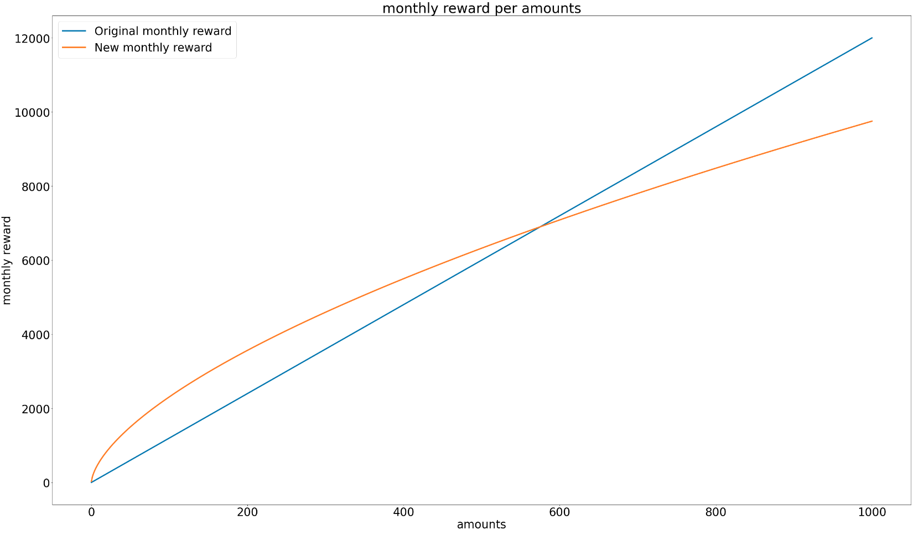
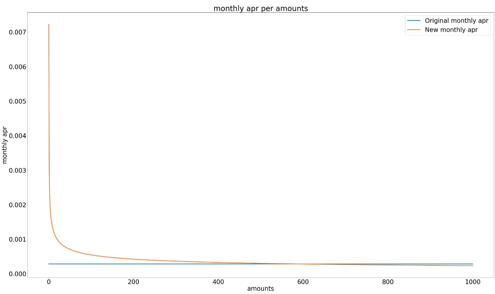

Hello StakeWise DAO! 

Today I want to detail an [idea I mentioned](https://forum.stakewise.io/t/swip-3-deploy-seth2-eth-and-seth2-reth2-liquidity-pools-on-uniswap-v3/336/3?u=dreth) in my reply to this thread. Where I compared the possibility of flattening the $SWISE rewards curve for the upcoming Uniswap pools in order to avoid extending voting power inequality (as a result of wealth) within DAO members.

I would like to start a discussion on this and see your opinions on possibly implementing this before $SWISE rewards start for the respective proposed pools in [SWIP-3](https://forum.stakewise.io/t/swip-3-deploy-seth2-eth-and-seth2-reth2-liquidity-pools-on-uniswap-v3).

# Motivation

Pool rewards (so far) have been incentivized with a fixed amount of $SWISE given to all participants in the pool at a fixed APR. This means that significantly larger stacks earn significantly larger amounts of $SWISE.

Wealth distribution on the blockchain is naturally very skewed, there's a lot more users with small amounts and very few addresses own significantly more cryptocurrency than others.

Given the $SWISE original airdrop, this has created a reasonable but also somewhat meaningless skewness in the distribution of $SWISE, with a few wallets holding significantly more than others, some of which also could have benefitted (if they aren't doing so now) from the 1Inch pool farming incentives.

Wealth inequality is an inherent aspect of most projects, and the intention is not to fix this in any way shape or form, but rather to somewhat flatten the rewards curve for the upcoming Uniswap pools (if possible). A linear curve contributes to giving more voting power to larger wallets, naturally, as for instance 0.5% of 10k > 0.5% of 100.

## Proposed rewards curve

The idea is to incentivize the proposed sETH2/ETH and rETH2/sETH2 pools in [SWIP-3](https://forum.stakewise.io/t/swip-3-deploy-seth2-eth-and-seth2-reth2-liquidity-pools-on-uniswap-v3) with $SWISE in a **non-linear way.**

I quickly put together a [python script](https://github.com/dreth/CodeSnippets/blob/master/simulate_SWISE_rewards_curve/curve.py) that I used to simulate and plot a rewards (in amount of $SWISE), the monthly and the yearly APR of the linear rewards curve (original method) vs the flattened curve (proposed method).

I had 2 very random ideas which I quickly coded as to conceptually show how  the rewards curve would be hypothetically flattened in a way that still makes farming with a large wallet very profitable, but pushing some of the possible earned voting power to smaller wallets.

* Monthly rewards curve example
  * X-axis shows amounts the user has in the pool in ETH
  * Y-axis shows the monthly reward obtained by the user in $SWISE
  * This example was made with a monthly reward of 0.6% of the $SWISE supply, as specified for the sETH2/ETH pool in [SWIP-3](https://forum.stakewise.io/t/swip-3-deploy-seth2-eth-and-seth2-reth2-liquidity-pools-on-uniswap-v3)
  * The data is randomly generated and does not necessarily portray the actual distribution of the staked ether in the StakeWise pool

* Corresponding monthly APR for the pool
  * X-axis shows amounts the user has in the pool in ETH
  * Y-axis shows the corresponding monthly APR based on the price of $SWISE at the time of writing and the proposed incentive of 0.6% of the $SWISE supply monthly proposed for the sETH2/ETH pool.
  * The data is randomly generated and does not necessarily portray the actual distribution of the staked ether in the StakeWise pool

## Methodology

1. Take the value (in USD) of the amount of ETH of all participating wallets (in this case, we refer to holdings as an array of the **total amount ETH that each wallet contributes to the respective pool**)
2. We apply the flattening function. An example could be raising all the elements in the array to a power between 0 and 1, this reduces the scale of the values somewhat and makes larger wallets slightly less meaningful in the total weight of the